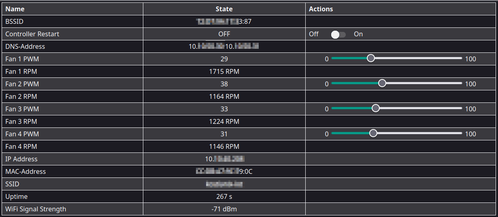
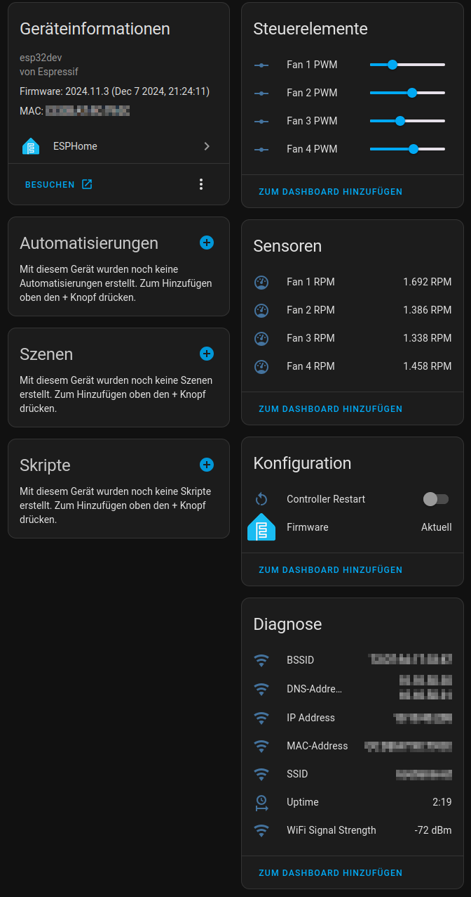

# Note

This is a fork of [WiFiFanCon](https://github.com/Hypfer/WiFiFanCon) by @Hypfer .
This project adds a compatible esphome config for the same hardware. As the original 
author [does not want to have this in his repo](https://github.com/Hypfer/WiFiFanCon/pull/2), 
this fork remains standalone. I removed the PCB files and the tasmota config, 
visit the original repo mentioned above for those.

# WiFiFanController

Control 12V PC Fans via Wi-Fi or Homeassistant with [esphome](https://esphome.io/)

Hardware:

esphome-webgui (if enabled)

Homeassistant gui (with hidden entities enabled)

## Features

- Support of up to four 4-Pin PWM 12V PC Fans *(This does only work for PWM, _NOT_ work for DC-controlled FANs!)*
- Individual RPM Monitoring for all 4 Fans
- Full control via a Webinterface
- Different Voltage extension headers to allow for customization with e.g. additional temperature probes or other sensors
- Very easy beginner-friendly THT soldering
- Fits snugly into an isolated 45ct junction box

## Where?

### Hardware

Head over to the original repo at [https://github.com/Hypfer/WiFiFanCon/pcb](https://github.com/Hypfer/WiFiFanCon/pcb) for the PCB.

### Software

fill in your secret-variables or use a `secrets.yaml`and install the project's [yaml](./esphome/wififancontrol.yaml) via one of esphome's installation methods.
Have a look into esphome's extensive documentation if you never have used it before.

## Why?

I do have quite a few heat-producing devices such as servers or Hi-Fi equipment which are trapped in whatever
furniture from Ikea barely fit them. This achieves a clean look but also kills the hardware due to insufficient ventilation.

My first solution for this was to add a few very silent 12V Noctua NF-A14 PWM PC Fans and run them at 5V with 33% duty cycle using an Arduino nano.
While that worked just fine, after a year, I've noticed quite a lot of dust buildup on the Fans as well as everything else.

Therefore, I was looking for a way to periodically run the Fans at full speed to blow away whatever dust buildup there might be.
How else would you do that if not automated via Home Assistant?

## Pictures?

## How?

As it turns out, the ESP32 offers everything required for such a project.
It has Wi-Fi, it can do 25kHz PWM with more than 4 channels and it is also capable of monitoring the Fan speed.
Furthermore, as it is available as a full devkit PCB, flashing, soldering and everything else is very easy.

Therefore, I basically just needed to design a PCB that features a DC Jack, some Fan Headers and connects everything in a neat package.
Because it is only 70x70mm in size, it perfectly fits into these dirt-cheap german junction boxes, which you can get for 45 cents each.

## Why not use something else?

While there are other projects on GitHub achieving similar things, they didn't really 100% fit my requirements, which are:

- Set Fanspeed to x%
- Don't care about temperature
- Show up in home assistant
- Be very easy to solder

## Curlpits

The selection of Fans is absolutely key! Many PWM-PC-Fans do not actually stop at 0% PWM. Some do (like e.g. pretty much all Fans 
from `Noctua` and from `Iceberg-Thermal`), but many doen't. Some Fans fall back to a "reasonable minimum" to provide at least some 
airflow (like many Serverfans), which is mostly equivalent to 25-35% ofthe PWM range. Some act like 0% PWM is the minimal value on 
which the FANs should run (like some FANs from `arctic' that i tested, even tough they claim to stop at 0% PWM!). And some (most 
likely very old) PWM-FANs stop below a certain PWM-range and oscillate back and forth, because there is not enough oompf to kick 
them up, and the motor is stalling the fan. The last example is very unhealthy for the fan. While there maybe a 5-15% range, where 
it would be possible to kick up the Fan by first setting it to 100% and then to the desired level, you _really_ should avoid this!

You might have to test out for yourself what works best for you. If you don't care about Money, just go with Noctua. They are top-notch 
in every regard (except for their default color-scheme). However, I also quite like the Fans from [Iceberg Thermal](https://www.iceberg-thermal.com/product-category/consumer/case-fan/), 
because they offer black, grey, rgb and teal Fans and are reasonable cheap. However, if you need alot of FANs for your project, get one and test first.

## License

This hardware is licensed under the
[Creative Commons Attribution-ShareAlike 4.0 International License][cc-by-sa].

[![CC BY-SA 4.0][cc-by-sa-image]][cc-by-sa]

The software is licensed under the Apache-2.0 license.

[cc-by-sa]: http://creativecommons.org/licenses/by-sa/4.0/
[cc-by-sa-image]: ./img/cc-by-sa.png
